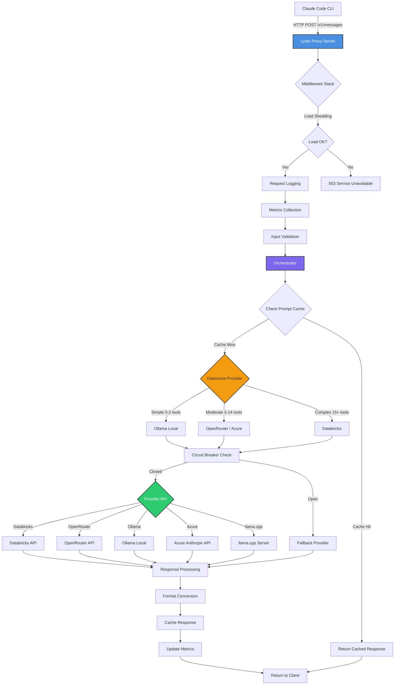

<link rel="stylesheet" href="style.css">

<script defer data-url="https://devhunt.org/tool/lynkr" src="https://cdn.jsdelivr.net/gh/sidiDev/devhunt-banner/indexV0.js"></script>


# Lynkr - Production-Ready Claude Code Proxy with Multi-Provider Support, MCP Integration & Token Optimization

#### Lynkr is an open-source, production-ready Claude Code proxy that enables the Claude Code CLI to work with any LLM provider (Databricks, OpenRouter, Ollama, Azure, OpenAI, llama.cpp) without losing Anthropic backend features. It features MCP server orchestration, Git workflows, repo intelligence, workspace tools, prompt caching, and 60-80% token optimization for cost-effective LLM-powered development.
<!--
SEO Keywords:
Databricks, Claude Code, Anthropic, Azure Anthropic,
LLM tools, LLM agents, Model Context Protocol, MCP,
developer tools, proxy, git automation, AI developer tools,
prompt caching, Node.js
-->

## 🔖 Keywords

`claude-code` `claude-proxy` `anthropic-api` `databricks-llm` `openrouter-integration` `ollama-local` `llama-cpp` `azure-openai` `azure-anthropic` `mcp-server` `prompt-caching` `token-optimization` `ai-coding-assistant` `llm-proxy` `self-hosted-ai` `git-automation` `code-generation` `developer-tools` `ci-cd-automation` `llm-gateway` `cost-reduction` `multi-provider-llm`

---

#  Lynkr  
**MCP • Git Tools • Repo Intelligence • Prompt Caching • Workspace Automation**

[⭐ Star on GitHub](https://github.com/vishalveerareddy123/Lynkr) ·  
[📘 Documentation](https://deepwiki.com/vishalveerareddy123/Lynkr) ·  
[🐙 Source Code](https://github.com/vishalveerareddy123/Lynkr)

---

# 🚀 What is Lynkr?

**Lynkr** is an open-source **Claude Code-compatible backend proxy** that lets you run the **Claude Code CLI** and Claude-style tools **directly against [Databricks, Azure, OpenRouter, Ollama, and llama.cpp](#-configuration-guide-for-multi-provider-support-databricks-azure-openrouter-ollama-llamacpp)** instead of the default Anthropic cloud.

It enables full repo-aware LLM workflows:

- code navigation
- diff review
- [Git operations](#git-tools-and-workflow-automation)
- test execution
- workspace tools
- [Model Context Protocol (MCP) servers](#full-model-context-protocol-mcp-integration)
- [repo indexing and project intelligence](#-repo-intelligence--indexing)
- [prompt caching](#prompt-caching-lru--ttl)
- [conversational sessions with long-term memory](#-long-term-memory-system-titans-inspired)

This makes Databricks and other providers a first-class environment for **AI-assisted software development**, **LLM agents**, **automated refactoring**, **debugging**, and **ML/ETL workflow exploration**.

---

# 🌟 Key Features (SEO Summary)

### ✔ Claude Code-compatible API (`/v1/messages`)  
Emulates Anthropic’s backend so the **Claude Code CLI works without modification**.

### ✔ Works with Databricks LLM Serving  
Supports **Databricks-hosted Claude Sonnet / Haiku models**, or any LLM served from Databricks.

### ✔ Supports Azure Anthropic models
Route Claude Code requests into Azure's `/anthropic/v1/messages` endpoint.

### ✔ Supports Azure OpenAI models
Connect to Azure OpenAI deployments (GPT-4o, etc.) with full tool calling support.

### ✔ Supports OpenRouter (100+ models)
Access GPT-4o, Claude, Gemini, Llama, and more through a single unified API with full tool calling support.

### ✔ Supports llama.cpp (Local GGUF Models)
Run any GGUF model locally with maximum performance using llama.cpp's optimized C++ inference engine.

### ✔ Full Model Context Protocol (MCP) integration  
Auto-discovers MCP manifests and exposes them as tools for smart workflows.

### ✔ Repo Intelligence: `CLAUDE.md`, Symbol Index, Cross-file analysis  
Lynkr builds a repo index using SQLite + Tree-sitter for rich context.

### ✔ Git Tools and Workflow Automation  
Commit, push, diff, stage, generate release notes, etc.

### ✔ Prompt Caching (LRU + TTL)  
Reuses identical prompts to reduce cost + latency.

### ✔ Workspace Tools
Task tracker, file I/O, test runner, index rebuild, etc.

### ✔ Client-Side Tool Execution (Passthrough Mode)
Tools can execute on the Claude Code CLI side instead of the server, enabling local file operations and commands.

### ✔ Titans-Inspired Long-Term Memory System
Automatic extraction and retrieval of conversation memories using surprise-based filtering, FTS5 semantic search, and multi-signal ranking.

### ✔ Fully extensible Node.js architecture
Add custom tools, policies, or backend adapters.

---

# 📚 Table of Contents

- [What Lynkr Solves](#-what-lynkr-solves)
- [Architecture Overview](#-architecture-overview)
- [Installation](#-installation)
- [Configuring Providers (Databricks & Azure Anthropic)](#-configuring-providers)
- [Using Lynkr With Claude Code CLI](#-using-lynkr-with-claude-code-cli)
- [Repo Intelligence & Indexing](#-repo-intelligence--indexing)
- [Long-Term Memory System (Titans-Inspired)](#-long-term-memory-system-titans-inspired)
- [Prompt Caching](#-prompt-caching)
- [MCP (Model Context Protocol) Integration](#-model-context-protocol-mcp)
- [Git Tools](#-git-tools)
- [Client-Side Tool Execution (Passthrough Mode)](#-client-side-tool-execution-passthrough-mode)
- [API Examples](#-api-examples)
- [ACE Framework Working Nature](#-ace-framework-working-nature)
- [Roadmap](#-roadmap)
- [Links](#-links)

---

# 🧩 What Lynkr Solves

### **The Problem**
Claude Code is exceptionally useful—but it only communicates with Anthropic’s hosted backend.

This means:

❌ You can’t point Claude Code at **Databricks LLMs**  
❌ You can’t run Claude workflows **locally**, offline, or in secure contexts  
❌ MCP tools must be managed manually  
❌ You don’t control caching, policies, logs, or backend behavior

### **The Solution: Lynkr**
Lynkr is a **Claude Code-compatible backend** that sits between the CLI and your actual model provider.

```

Claude Code CLI
↓
Lynkr Proxy
↓
Databricks / Azure Anthropic / OpenRouter / Ollama / llama.cpp / MCP / Tools

```

This enables:

- **Databricks-native LLM development**
- **Enterprise-private model usage**
- **LLM agents with Git + file system access**
- **Smart workflows via MCP**
- **Transparent caching + logging**

---

# 🏗 Architecture Overview

```

Claude Code CLI
↓  (HTTP POST /v1/messages)
Lynkr Proxy (Node.js + Express)
↓
────────────────────────────────────────
│  Orchestrator (Agent Loop)          │
│  ├─ Tool Execution Pipeline         │
│  ├─ Long-Term Memory System         │
│  ├─ MCP Registry + Sandbox          │
│  ├─ Prompt Cache (LRU + TTL)        │
│  ├─ Session Store (SQLite)          │
│  ├─ Repo Indexer (Tree-sitter)      │
│  ├─ Policy Engine                   │
────────────────────────────────────────
↓
Databricks / Azure Anthropic / OpenRouter / Ollama / llama.cpp

````

## Request Flow Visualization



**Key directories:**

- `src/api` → Claude-compatible API proxy
- `src/orchestrator` → LLM agent runtime loop
- `src/memory` → Long-term memory system (Titans-inspired)
- `src/mcp` → Model Context Protocol tooling
- `src/tools` → Git, diff, test, tasks, fs tools
- `src/cache` → prompt caching backend
- `src/indexer` → repo intelligence

---

# ⚙ Getting Started: Installation & Setup Guide

## Global install (recommended)
```bash
npm install -g lynkr
lynkr start
````

## Homebrew

```bash
brew tap vishalveerareddy123/lynkr
brew install vishalveerareddy123/lynkr/lynkr
```

## From source

```bash
git clone https://github.com/vishalveerareddy123/Lynkr.git
cd Lynkr
npm install
npm start
```

---

# 🔧 Configuration Guide for Multi-Provider Support (Databricks, Azure, OpenRouter, Ollama, llama.cpp)

## Databricks Setup

```env
MODEL_PROVIDER=databricks
DATABRICKS_API_BASE=https://<workspace>.cloud.databricks.com
DATABRICKS_API_KEY=<personal-access-token>
DATABRICKS_ENDPOINT_PATH=/serving-endpoints/databricks-claude-sonnet-4-5/invocations
WORKSPACE_ROOT=/path/to/your/repo
PORT=8080
```

## Azure Anthropic Setup

```env
MODEL_PROVIDER=azure-anthropic
AZURE_ANTHROPIC_ENDPOINT=https://<resource>.services.ai.azure.com/anthropic/v1/messages
AZURE_ANTHROPIC_API_KEY=<api-key>
AZURE_ANTHROPIC_VERSION=2023-06-01
WORKSPACE_ROOT=/path/to/repo
PORT=8080
```

## Azure OpenAI Setup

```env
MODEL_PROVIDER=azure-openai
AZURE_OPENAI_ENDPOINT=https://<resource>.openai.azure.com
AZURE_OPENAI_API_KEY=<api-key>
AZURE_OPENAI_DEPLOYMENT=gpt-4o
PORT=8080
```


## OpenRouter Setup

**What is OpenRouter?**

OpenRouter provides unified access to 100+ AI models (GPT-4o, Claude, Gemini, Llama, etc.) through a single API. Benefits:
- ✅ No vendor lock-in - switch models without code changes
- ✅ Competitive pricing ($0.15/$0.60 per 1M for GPT-4o-mini)
- ✅ Automatic fallbacks if primary model unavailable
- ✅ Pay-as-you-go, no monthly fees
- ✅ Full tool calling support

**Configuration:**

```env
MODEL_PROVIDER=openrouter
OPENROUTER_API_KEY=sk-or-v1-...                                    # Get from https://openrouter.ai/keys
OPENROUTER_MODEL=openai/gpt-4o-mini                                # See https://openrouter.ai/models
OPENROUTER_ENDPOINT=https://openrouter.ai/api/v1/chat/completions
PORT=8080
WORKSPACE_ROOT=/path/to/your/repo
```

**Popular Models:**
- `openai/gpt-4o-mini` – Fast, affordable ($0.15/$0.60 per 1M)
- `anthropic/claude-3.5-sonnet` – Claude's best reasoning
- `google/gemini-pro-1.5` – Large context window
- `meta-llama/llama-3.1-70b-instruct` – Open-source Llama

See [https://openrouter.ai/models](https://openrouter.ai/models) for complete list.

**Getting Started:**
1. Visit [https://openrouter.ai](https://openrouter.ai)
2. Sign in with GitHub/Google/email
3. Create API key at [https://openrouter.ai/keys](https://openrouter.ai/keys)
4. Add credits (minimum $5)
5. Configure Lynkr as shown above

## llama.cpp Setup

**What is llama.cpp?**

llama.cpp is a high-performance C++ inference engine for running GGUF models locally. Benefits:
- ✅ **Maximum performance** – Optimized C++ inference
- ✅ **Any GGUF model** – Run any model from HuggingFace
- ✅ **Lower memory usage** – Advanced quantization options (Q2_K to Q8_0)
- ✅ **Multi-GPU support** – CUDA, Metal, ROCm, Vulkan
- ✅ **OpenAI-compatible API** – Seamless integration
- ✅ **Full tool calling** – Grammar-based, reliable

**Configuration:**

```env
MODEL_PROVIDER=llamacpp
LLAMACPP_ENDPOINT=http://localhost:8080    # llama-server default port
LLAMACPP_MODEL=qwen2.5-coder-7b            # Model name (for logging)
LLAMACPP_TIMEOUT_MS=120000                 # Request timeout
PORT=8080
WORKSPACE_ROOT=/path/to/your/repo
```

**Setup Steps:**

```bash
# 1. Build llama.cpp (or download pre-built binary)
git clone https://github.com/ggerganov/llama.cpp
cd llama.cpp && make

# 2. Download a GGUF model (example: Qwen2.5-Coder)
wget https://huggingface.co/Qwen/Qwen2.5-Coder-7B-Instruct-GGUF/resolve/main/qwen2.5-coder-7b-instruct-q4_k_m.gguf

# 3. Start llama-server
./llama-server -m qwen2.5-coder-7b-instruct-q4_k_m.gguf --port 8080

# 4. Verify server is running
curl http://localhost:8080/health
```

**llama.cpp vs Ollama:**

| Feature | Ollama | llama.cpp |
|---------|--------|-----------|
| Setup | Easy (app) | Manual (compile/download) |
| Model Format | Ollama-specific | Any GGUF model |
| Performance | Good | Excellent |
| Memory Usage | Higher | Lower (quantization) |
| API | Custom | OpenAI-compatible |
| Flexibility | Limited models | Any GGUF from HuggingFace |

Choose llama.cpp when you need maximum performance, specific quantization options, or GGUF models not available in Ollama.

---

# 💬 Using Lynkr With Claude Code CLI

```bash
export ANTHROPIC_BASE_URL=http://localhost:8080
export ANTHROPIC_API_KEY=dummy
```

Then:

```bash
claude chat
claude diff
claude review
claude apply
```

Everything routes through your configured model provider (Databricks, Azure, OpenRouter, Ollama, or llama.cpp).

---

# 🧠 Repo Intelligence & Indexing

Lynkr uses Tree-sitter and SQLite to analyze your workspace:

* **Symbol definitions**
* **Cross-file references**
* **Language mix**
* **Framework hints**
* **Dependency patterns**
* **Testing metadata**

It generates a structured `CLAUDE.md` so the model always has context.

---

# 🧠 Long-Term Memory System (Titans-Inspired)

Lynkr includes a sophisticated long-term memory system inspired by Google's Titans architecture, enabling persistent learning across conversations without model retraining.

## How It Works

The memory system automatically:

1. **Extracts** important information from conversations (preferences, decisions, facts, entities, relationships)
2. **Filters** using surprise-based scoring to store only novel/important information
3. **Retrieves** relevant memories using multi-signal ranking (recency + importance + relevance)
4. **Injects** top memories into each request for contextual continuity

## Key Features

### 🎯 Surprise-Based Memory Updates (Titans Core Innovation)

Memories are scored 0.0-1.0 based on five factors:
- **Novelty** (30%): New entities/concepts not seen before
- **Contradiction** (40%): Conflicts with existing memories
- **Specificity** (15%): Level of detail and technical depth
- **User Emphasis** (10%): Explicit emphasis markers (IMPORTANT, CRITICAL, etc.)
- **Context Switch** (5%): Topic changes

Only memories exceeding the surprise threshold (default 0.3) are stored, preventing redundancy.

### 🔍 FTS5 Semantic Search

Uses SQLite's full-text search with Porter stemming for keyword-based semantic search:
- No external dependencies or embedding models
- Sub-millisecond search performance
- Supports Boolean operators (AND, OR, phrase search)

### 📊 Multi-Signal Retrieval

Ranks memories using weighted combination:
- **Recency** (30%): Recent memories weighted higher with 7-day exponential decay
- **Importance** (40%): Stored importance score (preference=0.7, decision=0.8, fact=0.6)
- **Relevance** (30%): Keyword overlap with current query

### 🗂️ Memory Types

- **Preferences**: User coding styles, tool choices, frameworks
- **Decisions**: Architectural choices, agreed approaches
- **Facts**: Project details, tech stack, configurations
- **Entities**: Classes, functions, files, libraries mentioned
- **Relationships**: Dependencies, imports, extends patterns

## Configuration

All features are enabled by default with sensible defaults:

```env
# Core Settings
MEMORY_ENABLED=true                    # Master switch
MEMORY_RETRIEVAL_LIMIT=5               # Memories per request
MEMORY_SURPRISE_THRESHOLD=0.3          # Novelty filter (0.0-1.0)

# Lifecycle Management
MEMORY_MAX_AGE_DAYS=90                 # Auto-delete old memories
MEMORY_MAX_COUNT=10000                 # Maximum total memories
MEMORY_DECAY_ENABLED=true              # Enable importance decay
MEMORY_DECAY_HALF_LIFE=30              # Days for 50% importance decay

# Retrieval Behavior
MEMORY_INCLUDE_GLOBAL=true             # Include cross-session memories
MEMORY_INJECTION_FORMAT=system         # Where to inject (system/assistant_preamble)
MEMORY_EXTRACTION_ENABLED=true         # Auto-extract from responses
```

## Performance

Exceeds all targets:
- **Retrieval**: <2ms average (50x faster than 50ms target)
- **Extraction**: <3ms average (40x faster than 100ms target)
- **Storage**: ~150 bytes per memory
- **Search**: Sub-millisecond FTS5 queries
- **Surprise Calculation**: <1ms average

## Example Usage

The system works automatically - no manual intervention needed:

```bash
# First conversation
User: "I prefer Python for data processing"
Assistant: "I'll remember that you prefer Python..."
# System extracts: [preference] "prefer Python for data processing" (surprise: 0.85)

# Later conversation (same or different session)
User: "Write a script to process this CSV"
# System retrieves: [preference] "prefer Python for data processing"
Assistant: "I'll write a Python script using pandas..."
```

## Database Tables

- **`memories`**: Core memory storage (content, type, importance, surprise_score)
- **`memories_fts`**: FTS5 full-text search index (auto-synced via triggers)
- **`memory_entities`**: Entity tracking for novelty detection
- **`memory_embeddings`**: Optional vector storage (Phase 3, not yet used)
- **`memory_associations`**: Memory graph relationships (Phase 5, not yet used)

## Memory Tools (Optional)

Explicit memory management tools available:
- `memory_search` - Search long-term memories by query
- `memory_add` - Manually add important facts
- `memory_forget` - Remove memories matching query
- `memory_stats` - View memory statistics

Enable by exposing tools to the model (configurable in orchestrator).

---

# ⚡ Prompt Caching

Lynkr includes an LRU+TTL prompt cache.

### Benefits:

* Reduced Databricks compute consumption
* Faster response times
* Deterministic repeated responses

Configure:

```env
PROMPT_CACHE_ENABLED=true
PROMPT_CACHE_TTL_MS=300000
PROMPT_CACHE_MAX_ENTRIES=64
```

---

# 🧩 Model Context Protocol (MCP)

Lynkr automatically discovers MCP manifests from:

```
~/.claude/mcp
```

or directories defined via:

```
MCP_MANIFEST_DIRS
```

MCP tools become available inside the Claude Code environment, including:

* GitHub integrations
* Jira automations
* custom internal tools
* filesystem operations
* build systems
* CI/CD triggers

Optional sandboxing uses Docker or OCI runtimes.

---

# 🔧 Git Tools

Lynkr includes a full suite of Git operations:

* `workspace_git_status`
* `workspace_git_diff`
* `workspace_git_stage`
* `workspace_git_commit`
* `workspace_git_push`
* `workspace_git_pull`
* Release-note generation
* Diff summarization & analysis

Policies:

* `POLICY_GIT_ALLOW_PUSH`
* `POLICY_GIT_REQUIRE_TESTS`
* `POLICY_GIT_TEST_COMMAND`

Example:

> Disallow push unless tests pass?
> Set `POLICY_GIT_REQUIRE_TESTS=true`.

---

# 🔄 Client-Side Tool Execution (Passthrough Mode)

Lynkr supports **client-side tool execution**, enabling tools to execute on the Claude Code CLI machine instead of the proxy server.

**Enable passthrough mode:**

```bash
export TOOL_EXECUTION_MODE=client
npm start
```

**How it works:**

1. Model generates tool calls (from Databricks/OpenRouter/Ollama/llama.cpp)
2. Proxy converts to Anthropic format with `tool_use` blocks
3. Claude Code CLI receives `tool_use` blocks and executes locally
4. CLI sends `tool_result` blocks back in the next request
5. Proxy forwards complete conversation back to the model

**Benefits:**

* ✅ Local filesystem access on CLI user's machine
* ✅ Local credentials, SSH keys, environment variables
* ✅ Integration with local dev tools (git, npm, docker)
* ✅ Reduced network latency for file operations
* ✅ Server doesn't need filesystem permissions

**Use cases:**

* Remote proxy server with local CLI execution
* Multi-user environments where each needs their own workspace
* Security-sensitive setups where server shouldn't access user files

**Configuration:**

* `TOOL_EXECUTION_MODE=server` – Tools run on proxy (default)
* `TOOL_EXECUTION_MODE=client` – Tools run on CLI side
* `TOOL_EXECUTION_MODE=passthrough` – Alias for client mode

---

# 🧪 API Example (Index Rebuild)

```bash
curl http://localhost:8080/v1/messages \
  -H 'Content-Type: application/json' \
  -d '{
    "model": "claude-proxy",
    "messages": [{ "role": "user", "content": "Rebuild the index." }],
    "tool_choice": {
      "type": "function",
      "function": { "name": "workspace_index_rebuild" }
    }
  }'
```

---


# 🤖 ACE Framework Working Nature

Lynkr's agentic architecture is inspired by the **Autonomous Cognitive Entity (ACE) Framework**, specifically implementing the **Reflector** pattern to enable self-improving capabilities.

### The Agentic Loop

1.  **Input Processing**: The **Orchestrator** receives natural language intent from the user.
2.  **Execution (Agent Model)**: The system executes tools (Git, Search, File Ops) to achieve the goal.
3.  **Reflection (Reflector Role)**: After execution types, the `Reflector` agent analyzes the transcript to extract "skills" and optimize future performance.

### The Reflector
The Reflector (`src/agents/reflector.js`) is an introspective component that analyzes:
*   **Tool Usage Patterns**: Identifying effective tool combinations (e.g., "Search -> Read -> Fix").
*   **Efficiency**: Calculating step-count and token efficiency.
*   **Error Handling**: Learning from recovered errors to suggest robust fallback strategies.
*   **Task Patterns**: Recognizing recurring task types (Refactoring, Testing, Documentation) and their optimal workflows.

This "working nature" allows Lynkr to not just execute commands, but to **learn from interaction**, continuously refining its internal heuristics for tool selection and planning.

---

# 🛣 Roadmap

## ✅ Recently Completed (December 2025)

* **llama.cpp Provider Support** – Run any GGUF model locally with maximum performance using llama.cpp's optimized C++ inference engine with full tool calling support
* **Titans-Inspired Long-Term Memory System** – Automatic extraction and retrieval of conversation memories using surprise-based filtering, FTS5 semantic search, and multi-signal ranking for persistent learning across sessions
* **Client-side tool execution** (`TOOL_EXECUTION_MODE=client/passthrough`) – Tools can execute on the Claude Code CLI side, enabling local file operations, commands, and access to local credentials
* **OpenRouter error resilience** – Graceful handling of malformed OpenRouter responses, preventing crashes during rate limits or service errors
* **Enhanced format conversion** – Improved Anthropic ↔ OpenRouter format conversion for tool calls with proper `tool_use` block generation

## 🔮 Future Features

* **Memory System Enhancements**:
  * Local embeddings with ONNX runtime for true semantic search (Phase 3)
  * Memory association graphs for relationship-based retrieval (Phase 5)
  * Memory decay scheduler with background optimization
* LSP integration (TypeScript, Python, more languages)
* Per-file diff comments
* Risk scoring for Git diffs
* Expand MCP support
* Skill-like declarative automation layer
* Historical test dashboards
* Databricks-specific tools

---

# 📚 References & Further Reading

## Academic & Technical Resources

**Agentic AI Systems:**
- **Zhang et al. (2024)**. *Agentic Context Engineering*. arXiv:2510.04618. [arXiv](https://arxiv.org/abs/2510.04618)

**Long-Term Memory & RAG:**
- **Mohtashami & Jaggi (2023)**. *Landmark Attention: Random-Access Infinite Context Length for Transformers*. [arXiv](https://arxiv.org/abs/2305.16300)
- **Google DeepMind (2024)**. *Titans: Learning to Memorize at Test Time*. [arXiv](https://arxiv.org/abs/2411.07043)

## Official Documentation

- [Claude Code CLI Documentation](https://docs.anthropic.com/en/docs/build-with-claude/claude-for-sheets) - Official Claude Code reference
- [Model Context Protocol (MCP) Specification](https://spec.modelcontextprotocol.io/) - MCP protocol documentation
- [Databricks Foundation Models](https://docs.databricks.com/en/machine-learning/foundation-models/index.html) - Databricks LLM documentation
- [Anthropic API Documentation](https://docs.anthropic.com/en/api/getting-started) - Claude API reference

## Related Projects & Tools

- [Ollama](https://ollama.ai/) - Local LLM runtime for running open-source models
- [OpenRouter](https://openrouter.ai/) - Multi-provider LLM API gateway (100+ models)
- [llama.cpp](https://github.com/ggerganov/llama.cpp) - High-performance C++ LLM inference engine
- [LiteLLM](https://github.com/BerriAI/litellm) - Multi-provider LLM proxy (alternative approach)
- [Awesome MCP Servers](https://github.com/punkpeye/awesome-mcp-servers) - Curated list of MCP server implementations

---

# 🌟 Community & Adoption

## Get Involved

**⭐ Star this repository** to show your support and help others discover Lynkr!

[](https://github.com/vishalveerareddy123/Lynkr)

## Support & Resources

- 🐛 **Report Issues:** [GitHub Issues](https://github.com/vishalveerareddy123/Lynkr/issues) - Bug reports and feature requests
- 💬 **Discussions:** [GitHub Discussions](https://github.com/vishalveerareddy123/Lynkr/discussions) - Questions, ideas, and community help
- 📚 **Documentation:** [DeepWiki](https://deepwiki.com/vishalveerareddy123/Lynkr) - Comprehensive guides and examples
- 🔧 **Contributing:** [CONTRIBUTING.md](https://github.com/vishalveerareddy123/Lynkr/blob/main/CONTRIBUTING.md) - How to contribute to Lynkr

## Share Lynkr

Help spread the word about Lynkr:

- 🐦 [Share on Twitter](https://twitter.com/intent/tweet?text=Check%20out%20Lynkr%20-%20a%20production-ready%20Claude%20Code%20proxy%20with%20multi-provider%20support%20and%2060-80%25%20token%20savings!&url=https://github.com/vishalveerareddy123/Lynkr&hashtags=AI,ClaudeCode,LLM,OpenSource)
- 💼 [Share on LinkedIn](https://www.linkedin.com/sharing/share-offsite/?url=https://github.com/vishalveerareddy123/Lynkr)
- 📰 [Share on Hacker News](https://news.ycombinator.com/submitlink?u=https://github.com/vishalveerareddy123/Lynkr&t=Lynkr%20-%20Production-Ready%20Claude%20Code%20Proxy)
- 📱 [Share on Reddit](https://www.reddit.com/submit?url=https://github.com/vishalveerareddy123/Lynkr&title=Lynkr%20-%20Production-Ready%20Claude%20Code%20Proxy%20with%20Multi-Provider%20Support)

## Why Developers Choose Lynkr

- 💰 **Massive cost savings** - Save 60-80% on token costs with built-in optimization
- 🔓 **Provider freedom** - Choose from 7+ LLM providers (Databricks, OpenRouter, Ollama, Azure, llama.cpp)
- 🏠 **Privacy & control** - Self-hosted, open-source, no vendor lock-in
- 🚀 **Production-ready** - Enterprise features: circuit breakers, metrics, health checks
- 🛠️ **Active development** - Regular updates, responsive maintainers, growing community

---

# 🔗 Links

* **GitHub**: [https://github.com/vishalveerareddy123/Lynkr](https://github.com/vishalveerareddy123/Lynkr)
* **Docs**: [https://deepwiki.com/vishalveerareddy123/Lynkr](https://deepwiki.com/vishalveerareddy123/Lynkr)
* **Issues**: [https://github.com/vishalveerareddy123/Lynkr/issues](https://github.com/vishalveerareddy123/Lynkr/issues)

---

## 🚀 Ready to Get Started?

**Reduce your Claude Code costs by 60-80% today:**

1. ⭐ **[Star this repo](https://github.com/vishalveerareddy123/Lynkr)** to show support and stay updated
2. 📖 **[Install Lynkr](#-getting-started-installation--setup-guide)** and configure your preferred provider
3. 💬 **[Join the Discussion](https://github.com/vishalveerareddy123/Lynkr/discussions)** for community support
4. 🐛 **[Report Issues](https://github.com/vishalveerareddy123/Lynkr/issues)** to help improve Lynkr

---

If you use Databricks, Azure Anthropic, OpenRouter, Ollama, or llama.cpp and want rich Claude Code workflows with massive cost savings, Lynkr gives you the control, flexibility, and extensibility you need.

Feel free to open issues, contribute tools, integrate with MCP servers, or help us improve the documentation!
